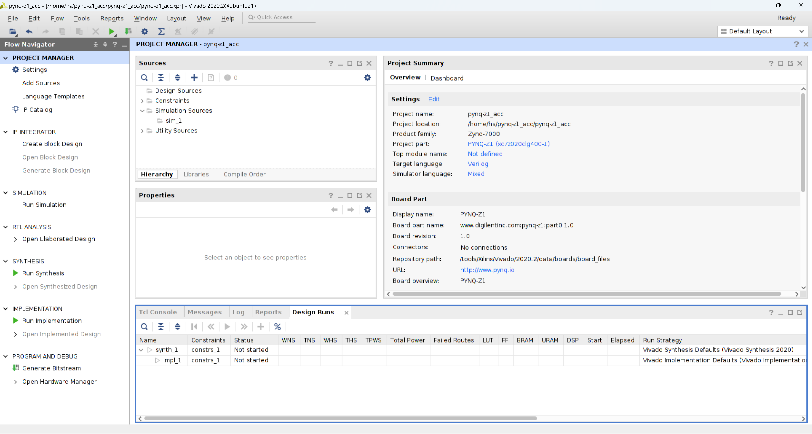

# 使用Python进行HLS IP的快速验证

## 实验背景

在本实验中，我们将使用 Vitis HLS 工具，将高级语言 C/C++ 编写的算法转换为RTL级硬件描述语言 Verilog/VHDL ，并导出为 IP 用于 Vivado Block design ，生成比特流后发送至 PYNQ 的 PS 端，通过 PS 端中的 Python  overlay 库来进行 PL 端的固化，最后在 PS 端通过 Python 函数来调用 IP 进行硬件加速 ，从而完成快速验证

## 实验准备
### Hardware 
- PYNQ-Z1  
- RJ45网线  
- Micro-USB线  
### Software
- Xilinx Vitis HLS 2020.2  
- Xilinx Vivado 2020.2
### Environment
- Ubuntu 20.04.6 LTS

## 实验内容
### 创建IP block

在本实验中，我们将设计一个标量标加法器的 IP 作为加速器进行后续实验  

在安装完 Vitis HLS 后，我们需要载入环境变量，在终端中执行以下 shell 命令
~~~shell
source /tools/Xilinx/Vivado/2020.2/settings64.sh
~~~
执行完成后，创建项目根目录，然后打开 Vitis HLS 2020.2 开始创建 IP
~~~shell
mkdir your_lab1_repo_path
cd your_lab1_repo_path
mkdir scalar_add
vitis_hls
~~~

 

点击 Create Project ，创建项目，输入项目名称 scalar_add，选择项目所在路径 your_lab1_repo_path/scalar_add 后点击 Next

 

 

接下来打开一个终端,实现标量加法器 [add.cpp](Chapter1_pynq_z1_acc/scalar_add/add.cpp)  
~~~shell
cd your_lab1_repo_path/scalar_add 
vim add.cpp
~~~
在Vim中键入变量加法程序后保存退出
~~~C++
void add(int a, int b, int& c) {
#pragma HLS INTERFACE ap_ctrl_none port=return
#pragma HLS INTERFACE s_axilite port=a
#pragma HLS INTERFACE s_axilite port=b
#pragma HLS INTERFACE s_axilite port=c
c = a + b;
}
~~~
回到 Vitis HLS 中，点击 Add file ，选择前面编写的 add.cpp 后点击 Open  
再点击 Top Function 右侧的 Browser ，选定 add 函数

 

 

接下来点击两次 Next ，跳过 Add/Remove TestBench files 。在 solution configuration 中点击 Part Selection ，选择 xc7z020clg400-1 即可。点击 OK 后，其他保持默认，点击 finish 完成项目创建。

 

在工具栏中点击C Synthesis进行综合，将标量加速器转换为RTL级描述

 

 
PS与PL端加速器是通过AXI总线进行交互，因此PS端需要知道加速器输入输出的AXI寄存器偏移值才能读写寄存器，此时需要保存偏移值，在综合完成后，在Synthesis Summary中向下翻页，找到SW-to-HW Mapping，保存a，b，c的偏移值

~~~shell
s_axi_control a offset=0x10
s_axi_control b offset=0x18
s_axi_control c offset=0x20
~~~

之后，将 RTL 导出为 IP

 

点击Configuration，配置一系列参数。完成后点击OK

 

 

设置 output location,完成后点击OK

 

以上完成了标量加法的 IP 生成，接下将 IP 与 PS 端处理器进行融合

### 创建Vivado工程

在IP准备就绪之后，将创建一个Vivado 项目，进行PS端与PL端的连接

在开始本节实验之前，请确保已经将PYNQ-Z1的board_file添加进Vivado之中  

* Pynq-Z1 Vivado board files https://pynq.readthedocs.io/en/v2.3/overlay_design_methodology/board_settings.html

完成之后，在终端中打开Vivado 2020.2
~~~shell
source /tools/Xilinx/Vivado/2020.2/settings64.sh
vivado
~~~
点击create project，输入项目名称 pynq-z1_acc，选择项目路径 your_lab1_repo_path

之后点击两次 Next ，跳过 Add soureces 和 Add constraints，在 Default part的 Board 中选择 PYNQ-Z1

 

完成后点击 Next 查看 summary，点击 finish 完成项目的创建

接下来我们将上一节导出的IP进行解压，打开一个新的终端  

~~~shell
cd your_lab1_repo_path/scalar_add
mkdir add_IP
unzip -x add.zip -d add_IP
mv add_IP ../
~~~

回到 Vivado ，点击 Create Block Design,输入设计名称 pynq_z1

接下来我们将导出的 IP 添加到 Vivado 的 IP 仓库中，点击工具栏中的 tools->settings ,再点击左侧 IP->Repository ,点击 "+" 后选择上文中 IP 解压的路径 your_lab1_repo_path/add_IP ，完成后会弹出对话框，点击两次 OK

接下来点击 Diagram 中的 “+” 添加 IP ，首先添加 ZYNQ 后双击，再添加我们的标量加法器 IP (此时 “+” 在 Diagram 顶部，或者 Ctrl + i )，最后以相同的方式添加 AXI iic IP

在完成所有 IP 的添加后，点击上方的 Run Connection Automation，在对话框中点击 All Automation ，再点击 OK

之后点击上方的 Run Block Automation，然后点击 OK 即可，完成后按下 Ctrl + S 保存 Block Design

由于PS端需要与PL端加速器通过AXI进行交互，还需要知道Vivado中VLNV值,点击Diagram中的加速器 IP ，记录下VLNV值 

~~~shell
VLNV	nobody:hls:add:1.0
~~~

完成后点击工具栏中的 File->Export->Export Block Design,之后选择存放路径，新建 export 文件夹进行存放

接下来在点击 Sources -> IP Sources -> Create HDL Wrapper,在弹出对话框中点击 OK 

最后点击 Generate Bitstream

 
在比特流生成以后我们以与导出 Block Design 相同的方式导出 File->Export->Export Bitstream File

最后我们导出 Hardware Handoff，它位于 your_lab1_repo_path/pynq-z1_acc/pynq-z1_acc.gen/sources_1/bd/<bd name>/hw_handoff/<bd_name>.hwh

我们在终端中进行拷贝
~~~shell
 cp your_lab1_repo_path/pynq-z1_acc/pynq-z1_acc.gen/sources_1/bd/pynq_z1/hw_handoff/pynq_z1.hwh your_lab1_repo_path/export
~~~

到此，Vivado工作全部完成

### 运行PYNQ加速器
首先将 SD 卡中烧录镜像，插入PYNQ，同时将PYNQ通过网线与PC相连，Micro-USB与PC相连，然后拨动开关，启动PYNQ
* Pynq-Z1 SD card image: http://www.pynq.io/board.html
* Pynq-Z1 setup guide: https://pynq.readthedocs.io/en/latest/getting_started/pynq_z1_setup.html

启动后，首先将 PC 的 IP 地址设置为与PS端在同一子网下，其中 ens** 为 PC 上与 PYNQ 相连的网卡，可以通过 ifconfig 查询

~~~shell
sudo ifconfig ens**  192.168.1.13
~~~

接下来在浏览器中键入 192.168.1.99:9090进入 Jupyter
默认密码 xilinx  

进入 Jupyter 后，点击右上角的 New -> Folder ,新建文件夹后修改文件夹名为 pynq_z1_Acc 

之后进入 pynq_z1_Acc 文件夹，点击右上角 Upload ，选定上文导出的 export 目录下的 3 个文件上传之 pynq_z1_Acc 中,依次点击 Upload

上传完成后点击 New -> Python3 ,开始创建 Python 函数,此时就会用到第一节和第二节中保存的寄存器偏移值和VLNV值

~~~python
from pynq import DefaultIP

class AddeDriver(DefaultIP):
    def __init__(self, description):
        super().__init__(description=description)

    bindto = ['nobody:hls:add:1.0']

    def add(self, a, b):
        self.write(0x10, a)
        self.write(0x18, b)
        return self.read(0x20)
~~~

点击顶部 Run后开始导入 Overlay 库

~~~python
from pynq import Overlay
overlay = Overlay('/home/xilinx/jupyter_notebooks/pynq_z1_Acc/pynq_z1.bit')
~~~
点击顶部 Run,开始查询Overlay库是否载入，接着输入
~~~python
overlay?
~~~

之后点击顶部 Run执行 
~~~python
overlay.add_0.add(10,5)
~~~

得到标量加法结果，实验一完成

实验一完成后，请保留Vivado工程和bitstream，方便后续实验

参考链接

https://www.hackster.io/whitney-knitter/rapid-prototyping-vitis-hls-ip-designs-using-pynq-f76910

