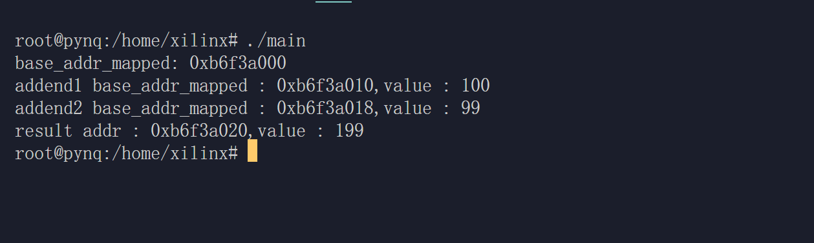

# 使用C++进行HLS IP的快速验证 

## 实验背景

在本实验中，我们将加速器作为外设，将其寄存器映射到 PS 端 Linux 操作系统的内存中，并在 PS 端开发 C++ 程序完成加速器的数据输入与输出，从而进行 HLS IP 的快速验证。

## 实验准备
### Hardware 
- PYNQ-Z1  
- RJ45网线  
- Micro-USB线  
### Software
- Xilinx Vivado 2020.2
### Environment
- Ubuntu 20.04.6 LTS

## 实验内容
### 创建IP block与Vivado工程
在实验二中，我们仍然选择使用实验一中创建的标量加法器 IP 作为加速器进行测试，接下来我们首先打开实验一中的 Vivado 工程
~~~shell
source /tools/Xilinx/Vivado/2020.2/settings64.sh
cd your_lab1_repo_path/pynq-z1_acc/ 
vivado pynq-z1_acc.xpr
~~~

点击 open Block Design -> Address Editor,记录下分配给标量加法器 IP 的Master Base Address 和 Range，这在之后内存映射时需要用到

 

由于我们没有修改任何连线或代码，所以可以直接沿用实验一生成的 Bitstream ，若想尝试自定义 IP 则重新生成，点击 Generate Bitstream

在生成完后，我们需要将 Bitstream 通过PS端固化，首先需要将 Bitstream 转换为bit.bin 格式，具体方式如下

首先创建 [Full_Bitstream.bif](/Chapter2_verification_using_c/Full_Bitstream.bif) 文件

~~~txt
all:
{
    pynq_z1_wrapper.bit /* Bitstream file name */
}
~~~
将其复制到 your_lab1_repo_path/pynq-z1_acc/pynq-z1_acc.runs/impl_1 目录下

在终端执行以下命令生成 pynq_z1_wrapper.bit.bin 文件：
~~~shell
cd your_lab1_repo_path/pynq-z1_acc/pynq-z1_acc.runs/impl_1
bootgen -image Full_Bitstream.bif -arch zynq -process_bitstream bin -w on
~~~

接下来我们先将 bit.bin 发送至 PS 端
~~~
scp -r your_lab1_repo_path/pynq-z1_acc/pynq-z1_acc.runs/impl_1/pynq_z1_wrapper.bit.bin  xilinx@192.168.1.99:~/  
~~~

至此，硬件部分准备完成

### 开发控制程序
Linux 下应用程序要通过设备驱动程序来访问外设，这就需要在设备树中添加设备，并且编写设备驱动程序。这是十分复杂的工作，在本实验中，由于 PS 端通过 AXI 4 与 PL 端直接相连，因此我们可以使用物理地址直接控制，但是在 PS 端 Linux上 运行的应用程序一般采用虚拟地址，在本实验中我们使用内存映射方法，实现加速器寄存器地址和进程虚拟地址空间中一段虚拟地址的一一映射关系。

在 Linux 中，可以使用 mmap() 函数将文件或设备映射到进程地址空间中。mmap() 函数的原型如下：

~~~c++
void *mmap(void *addr, size_t length, int prot, int flags, int fd, off_t offset);
~~~
其中, addr 表示映射区域的首地址,length 表示映射区域的长度, prot 表示映射区域的保护属性, flags 表示映射区域的标志,fd 表示要映射的文件描述符, offset 表示要映射的文件偏移量

接下来我们进行控制程序的开发[control.cpp](/Chapter2_verification_using_c/control.cpp)

~~~C++

#include <stdlib.h>
#include <stdio.h>
#include <unistd.h>
#include <sys/types.h>
#include <sys/stat.h>
#include <fcntl.h>
#include <sys/mman.h>
#include <unistd.h>
#define SCALAR_ADD_BASE_ADDRESS 0x40000000
#define MAP_SIZE 0x00010000
typedef unsigned int uint32_t;
int main()
{
    int fd;
    uint32_t *base_addr_mapped;
    fd = open("/dev/mem", O_RDWR | O_SYNC);
    base_addr_mapped = (uint32_t *)mmap(NULL, MAP_SIZE, PROT_READ | PROT_WRITE, MAP_SHARED, fd, SCALAR_ADD_BASE_ADDRESS);
    printf("base_addr_mapped: %p \n", base_addr_mapped);

    uint32_t *addend1;
    uint32_t *addend2;
    addend1 = base_addr_mapped + 0x00000004; // input addend1
    addend2 = base_addr_mapped + 0x00000006; // input addend2

    *addend1 = 100;
    *addend2 = 99;

    printf("addend1 base_addr_mapped : %p,value : %d\n", addend1, *addend1);
    printf("addend2 base_addr_mapped : %p,value : %d\n", addend2, *addend2);

    uint32_t *result;
    result = base_addr_mapped + 0x00000008; // output address

    printf("result addr : %p,value : %d\n", result, *result);
    munmap(base_addr_mapped, MAP_SIZE);
    close(fd);
}
~~~

由于 PS 端的 Linux 中有 g++ 编译工具，我们直接将控制程序源码上传至 PS 端
~~~shell
 scp -r your_lab2_path/control.cpp  xilinx@192.168.2.99:~/
~~~

接下来在 PS 端编译程序
~~~shell
ssh xilinx@192.168.2.99
g++ control.cpp -o main
~~~

### 运行加速器

接下来将在 PL 端固化前文生成的比特流，我们需要在 PS 端运行以下脚本 [Chapter2.sh](/Chapter2_verification_using_c/Chapter2.sh)

~~~shell
#! /bin/sh
cp pynq_z1_wrapper.bit.bin /lib/firmware/
echo 0 > /sys/class/fpga_manager/fpga0/flags
echo pynq_z1_wrapper.bit.bin > /sys/class/fpga_manager/fpga0/firmware

~~~

执行脚本
~~~
sudo chmod +x Chapter2.sh
sudo ./Chapter2.sh
~~~

接下来切换到 root 用户，执行控制程序
~~~shell
su root #若忘记或者未设置密码，可以使用sudo passwd root重置密码
./main
~~~

 

得到正确结果，实验结束

完成本次实验后需要前往 PKE 进行实验，完成 PKE lab4-3 后可以继续本实验3