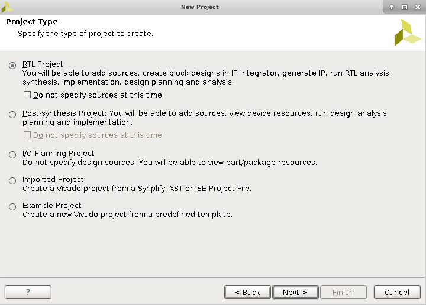
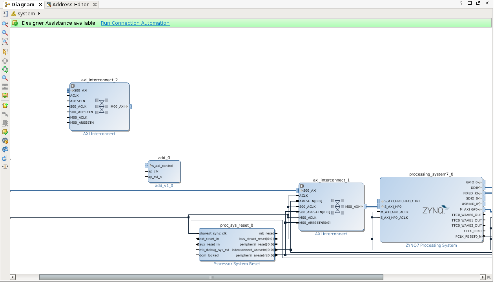

# 在Rocket Chip上添加HLS IP
## 实验背景
Rocket Chip 是基于 Chisel 开发的一款开源 SoC 生成器，它包含了由 RISC-V core，cache 以及互连 (interconnect) 等构成的模块库，以此为基础构成一个完整的 SoC，并可以生成可综合的 RTL 代码。  

在本实验中，我们将使用 Xilinx HLS 快速开发自定义 IP，将 IP 作为加速器使用，并使用 MMIO 将加速器寄存器映射到 Rocket Chip 生成的 RISC-V Soc 的内存空间中去，通过读写加速器的寄存器，完成加速

## 实验准备

### Hardware
- PYNQ-Z1  
- RJ45网线  
- Micro-USB线

### Software
- Xilinx Vivado 2016.2
### Environment
- Ubuntu 20.04.6 LTS

## 实验内容
### 创建 IP block

在本实验中，我们沿用了实验1的标量加法器 IP ,请注意，在本实验中我们使用 Xilinx Vivado 2016.2 来进行Rocket Chip的Block Design，由于 Xilinx Vitis HLS 不支持 2019.1 之前版本(包括)的 IP 导出，因此我们需要自行将 RTL 文件打包为 Xilinx Vivado 2016.2 版本的 IP

因此由于版本的差异，我们需要使用上文 Vitis HLS 生成的标量加法器 RTL 文件进行测试，以 Verilog 为例，我们使用以下文件进行实验
[add.v](/Chapter1_pynq_z1_acc/add_IP/hdl/verilog/add.v)
[add_control_s_axi.v](/Chapter1_pynq_z1_acc/add_IP/hdl/verilog/add_control_s_axi.v)

接下来打开终端，执行以下shell命令

~~~shell
source /tools/Xilinx/Vivado/2020.2/settings64.sh
cd your_lab3_repo_path 
mkdir hls_ip_repo #存放打包的IP
cd hls_ip_repo 
mkdir src #存放IP RTL文件
cp your_lab1_repo_path/add_IP/hdl/verilog/*   src #将上述两个verilog文件拷贝至add_ip_repo/src中
mkdir work #Vivado工作目录 生成log
cd work 
vivado 
~~~

打开 Vivado 后开始创建工程

 

点击 Next 后，输入项目名称和路径 , project location 选择 your_lab3_repo_path/hls_ip_repo ,再次点击 Next

 

默认 RTL Project ，点击 Next 跳过

 

在 Add source 中点击 Add Directories ， 选择 your_lab3_repo_path/hls_ip_repo/src 文件夹后点击 select

 

 

 

点击3次 Next，跳过 Add Existing IP 和 Add  Constraints ，进入 Default Part，在 Boards 中选择 PYNQ-Z1

 

之后点击 Next，再点击 Finish

 

点击工具栏中的 Tools->Create and Package IP ,然后点击 Next，默认 Package your current project ，点击 Next

 

默认 Include .xcl files 然后点击 Next ,再点击 Finish

 

点击底部 Package IP ,打包IP成功后点击OK

 

 

以上IP的创建完成，请记住打包好的IP的存放路径 your_lab3_repo_path/hls_ip_repo   
### 配置Rocket Chip 
#### fpga-pynq工程源码获取

为了方便大家快速获取源码，已将全部源码（包括子模块）打包上传到百度网盘，可以直接下载。

> 链接：[fpga-pynq](https://gitee.com/link?target=https%3A%2F%2Fpan.baidu.com%2Fs%2F1mTCcKG0EiFdxq4C5HTey3w) 提取码：1234

下载完成后，在命令行中执行如下命令，将源码进行解压。
~~~shell
cd 你的源码下载目录
cat fpga-pynq.0* > fpga-pynq.tar.gz     #组装文件
md5sum  fpga-pynq.tar.gz > md5   #计算MD5校验码
cmp md5 md5sum    #比对校验码，如果此处没有任何输出，则为正确
tar -zxvf fpga-pynq.tar.gz    #解压文件
~~~
或者从github获取源码：
~~~shell
git clone https://github.com/huozf123/fpga-pynq.git
cd fpga-pynq
git submodule update --init --recursive
~~~

获取源码之后，我们将使用环境变量记录源码的路径，便于后续开发

~~~shell
cd  fpga-pynq
export REPO= $PWD
~~~
####  工程编译环境配置

安装java jdk，首先检查电脑中是否已安装java，在中端输入以下命令：
~~~shell
java -version 
~~~
若能显示java版本号则表明已安装java，可以跳过java的安装。否则，继续在终端执行如下命令安装java 1.8：
~~~shell
sudo apt install openjdk-8-jre-headless
~~~
添加Vivado相关的环境变量，在命令行中执行（替换掉“你的Vivado安装目录”）：
~~~shell
source 你的Vivado安装目录/Vivado/2016.2/settings64.sh
source 你的Vivado安装目录/SDK/2016.2/settings64.sh
~~~
    建议直接将上述两行命令添加到~/.bashrc文件的末端，避免每次重新打开终端都需要重新执行。
    
因为Vivado、SDK存在bug，所以需要继续在命令行中执行以下命令（替换“你的Vivado安装目录”）：
~~~shell
sudo apt-get install libgoogle-perftools-dev
export SWT_GTK3=0
sudo sed -i "11,15s/^/#/" 你的Vivado安装目录/Vivado/2016.2/.settings64-Vivado.sh    #注释该文件第11-15行
~~~
最后初始化子模块（若从网盘中下载源码，则此步无需执行），执行：
~~~shell
cd $REPO/pynq-z2/
make init-submodules
~~~
#### 修改Rocket Chip

Rocket Chip相关的verilog文件主要是由Chisel自动生成的，这些verilog文件难以直接进行修改编辑。为了改变Rocket Chip的行为，正确的修改方式是对common/src/main/scala下的文件进行修改，并运行rocket chip生成器生成相关的verilog文件，再将生成的verilog文件复制到src/verilog工程目录下。其中运行rocket chip生成器以及复制文件的相关操作都已经为读者写入了make file中，并不需要手动执行，读者只需按照以下步骤修改相关配置文件，并按照说明执行编译命令即可。

为了能够在操作系统中像访问普通内存一样对新增IP进行访问，我们需要对Rocket Chip进行修改，为其添加MMIO的支持。然后需要在顶层verilog文件中增加MMIO接口，MMIO接口用来将Rocket Chip中的MMIO接口与block design中添加的MMIO_s_axi接口进行连接。

**步骤一：修改工程文件**

1. 修改Rocket Chip，以增加其对MMIO（Memory-mapped I/O）的支持
    
    修改文件`$REPO/common/src/main/scala/Top.scala`。修改后的文件为[Top.scala](/Chapter3_hls_with_rocketchip/Top.scala)，修改过的地方均有modified标识。
    
2. 修改工程顶层verilog文件，增加MMIO接口的连接
    
    修改文件`$REPO/common/rocketchip_wrapper.v`。修改后的文件为[rocketchip_wrapper.v](/Chapter3_hls_with_rocketchip/rocketchip_wrapper.v)，修改过的地方均有modified标识。
    
    
3. 生成Vivado工程
    在命令行中执行如下命令生成并打开Vivado工程：
    ~~~shell
    cd $REPO/pynq-z2/
    make project
    make vivado
    ~~~
至此，Rocket Chip 配置完成，接下来开始创建 Vivado  Block Design
### 创建Vivado工程

在打开的 Vivado 界面中，点击工具栏中的 Tools->Project Setting->IP->Repository Manager ,然后点击 “+”，选定前文创建的 IP

 

 

选定后点击 select ，然后会添加 IP，点击 OK，然后再点击 OK 退出对话框

 

 

添加完 IP 后，点击左侧的 Open Block Design，然后在 Diagram 中按下"ctrl+i",输入 add_v1_0 并双击

 

 

然后双击 add_v1_0 IP中的 s_axi_control 端口，在弹出的对话框中将 Frequency 改为 50MHz ，点击 OK

 

以相同的方式添加 IP  axi interconnect，然后双击新出现 axi_interconnect_2，将Number of Master Interface 改为1，然后点击 OK。

 

然后在最左边找到 S_AXI 端口，点击选中，然后再按 ctrl+c、ctrl+v ，这样就复制出一个同样的端口 S_AXI1 ，点击选中这个 S_AXI1 ，找到左边 External Interface Properties 面板，把 Name 改为 MMIO_S_AXI，Clock Port 选择 ext_clk_in ；选中最左侧的 ext_clk_in 端口，找到左边 External Port Properties 面板，将Frequency（Mhz） 修改为 50

 

 

 

然后将 add IP 的 ap_rst_n 连接至 proc_sys_rest_0 的 peripheral_aresetn 端口，
 add IP 的 ap_clk 连接至 ext_clk_in 端口  ， add IP的s_axi_control 连接至 axi_interconnect_2 的 M00_AXI ,  MMIO_S_AXI 连接至 axi_interconnect_2 的 S00_AXI ， axi_interconnect_2 的 ACLK， S00_ACLK 和 M00_ACLK 连接至 ext_clk_in ， ARESETN 连接至 proc_sys_rest_0 的 interconnect_aresetn ， S00_ARESETN 和 M00_ARESETN 连接至 proc_sys_rest_0 的 peripheral_aresetn 端口

最终如下图所示

 

最后点击Address Editor，给add_0进行地址分配，选中后鼠标右键弹出

 

记录下分配的偏移地址 0x6000_0000

 

完成后点击左侧 Generate Bitstream
至此 Rocket Chip 配置成功
### 开发控制程序

在进行本实验前需要完成PKE  lab4_3 硬链接
https://gitee.com/hustos/pke-doc/blob/master/chapter8_device.md#polling

在完成 lab4_3 硬链接 后，先提交答案到本地仓库
~~~shell
//切换到新的分支
git checkout lab5_1_poll
git merge lab4_3_hardlink -m "continue to work on lab5_1"
git checkout -b lab_add_hls_ip_on_rocketchip
//重新构造
make clean
~~~
我们在新的分支中进行本次实验，不影响PKE实验的继续进行

我们会在 PYNQ 的 PL 端固化 RocketChip 生成的 RISC-V 软核并运行 PKE OS，因此需要在 make 完成后，将 obj 目录下编译生成的可执行文件传输到开发板中，然后在开发板上运行程序读取IP的寄存器。

在前文的 RocketChip 配置中，我们已经实现了 MMIO 的硬件部分，现在需要完善 PKE  OS，首先我们需要新增的系统调用

在 kernel/syscall.h 36行中新增系统调用以及编号：
~~~c++
//Modified
// added @lab_add_hls_ip_on_rocketchip
#define SYS_user_put_addend1 (SYS_user_base + 33)
#define SYS_user_put_addend2 (SYS_user_base + 34)
#define SYS_user_get_result (SYS_user_base + 35)
~~~

同时在 kernel/syscall.c 的 do_syscall 函数中新增对应系统调用编号的实现函数，第304行添加
~~~c++
//Modified
case SYS_user_put_addend1:
  sys_user_put_addend1(a1);return 1;
case SYS_user_get_result:
  return sys_user_get_result();
case SYS_user_put_addend2:
  sys_user_put_addend2(a1);return 1;
~~~

最后在 kernel/syscall.c 中添加 sys_user_put_addend1 、 sys_user_put_addend2 和 sys_user_get_result 的具体实现，此时需要用到前文Vivado Block Design 中 Address Editor分配给add IP 的偏移地址，以及在生成HLS IP 时的 SW-to-HW 映射

~~~shell
s_axi_control a offset=0x10
s_axi_control b offset=0x18
s_axi_control c offset=0x20
~~~

~~~c++
void sys_user_put_addend1(uint8 ch) {
  volatile uint32 *tx = (void*)(uintptr_t)0x60000010;
  *tx = ch;
}
void sys_user_put_addend2(uint8 ch) {
  volatile uint32 *tx = (void*)(uintptr_t)0x60000018;
  *tx = ch;
}
ssize_t sys_user_get_result() {
  volatile uint32 *rx = (void*)(uintptr_t)0x60000020;
  return *rx;
}

~~~

在 user/user_lib.h 40添加

~~~C++
//Modified
int put_addend1(char ch);
int put_addend2(char ch);
int get_result();

~~~

在 user/user_lib.c 190行添加

~~~C++
//Modified
int put_addend1(char ch){
  return do_user_call(SYS_user_put_addend1, ch, 0, 0, 0, 0, 0, 0);
}

int put_addend2(char ch){
  return do_user_call(SYS_user_put_addend2, ch, 0, 0, 0, 0, 0, 0);
}

int get_result(){
  return do_user_call(SYS_user_get_result, 0, 0, 0, 0, 0, 0, 0);
}
~~~

此时 PKE OS 给用户态程序提供了三个读写 add IP 加速器的 API ，接下来我们进行控制程序的开发
修改 app_polling.c
~~~C++

#include "user_lib.h"
#include "util/types.h"

int main(void)
{

  char a = 100;
  char b = 99;
  printu("put %d as parameter 1 of Acceleration\n", (int)a);
  put_addend1(100);
  printu("put %d as parameter 2 of Acceleration\n", (int)b);
  put_addend2(99);

  printu("get char as Result of Acceleration\n");
  char temp = (char)get_result();
  printu("%d\n", temp);
  exit(0);
  return 0;
}
~~~
在这段程序中我们使用三个函数调用来完成 add IP 寄存器的读取，将 a,b 作为加数，使用 MMIO 写入加速器，之后使用 get_result() 函数读取运算结果

~~~shell
make
~~~

至此，PKE OS 以及加速器控制程序完全生成
### 运行PYNQ加速器

首先打包 Bitstream文件为 bin 文件，创建 [Full_Bitstream.bif](/Chapter3_hls_with_rocketchip/Full_Bitstream.bif) 文件

该文件为纯文本文件，可以直接用记事本创建，并输入如下内容后保存：
~~~txt
all:
{
    rocketchip_wrapper.bit /* Bitstream file name */
}
~~~
将该文件重命名为 Full_Bitstream.bif ，然后将其复制到 $REPO/pynq-z2/pynq_rocketchip_ZynqFPGAConfig/pynq_rocketchip_ZynqFPGAConfig.runs/impl_1 目录下。

在终端执行以下命令生成 bin 文件：
~~~shell
cd $REPO/pynq-z2/pynq_rocketchip_ZynqFPGAConfig/pynq_rocketchip_ZynqFPGAConfig.runs/impl_1
bootgen -image Full_Bitstream.bif -arch zynq -process_bitstream bin -w on
~~~

接下来我们需要将前文 Vivado 生成的 Bitstream bin 写入PYNQ的 PL 端，同时将PKE OS 和 app_polling 传送到 PS 端，再写入 PL 端

我们通过 scp 将以上三个文件写入

~~~shell
scp -r your_pke_lab_path/obj/app_polling  xilinx@192.168.1.99:~/  
scp -r your_pke_lab_path/obj/riscv-pke  xilinx@192.168.1.99:~/   
scp -r `$REPO/pynq-z2/pynq_rocketchip_ZynqFPGAConfig/pynq_rocketchip_ZynqFPGAConfig.runs/impl_1/rocketchip_wrapper.bit.bin  xilinx@192.168.1.99:~/  
~~~

然后登陆 xilinx
~~~shell
ssh xilinx@192.168.1.99 #密码输入xilinx
~~~
接下来我们需要创建脚本 [Chapter3.sh](/Chapter3_hls_with_rocketchip/Chapter3.sh) 烧写 Bitstream，完成固化
~~~shell
#! /bin/sh
cp rocketchip_wrapper.bit.bin /lib/firmware/
echo 0 > /sys/class/fpga_manager/fpga0/flags
echo rocketchip_wrapper.bit.bin > /sys/class/fpga_manager/fpga0/firmware
~~~

开始执行

~~~shell
sudo chmod +x Chapter3.sh
sudo ./Chapter3.sh  #若重启过开发板，则在执行程序前要先执行此脚本进行固化 
sudo ./riscv-fesvr riscv-pke app_polling #执行加速器控制程序
~~~

 

输入加数100和99，得到计算结果199，至此，本次实验全部完成

之后，请提交本次修改并切换回分支 lab5_1_poll,继续实验

~~~shell
make clean
git commit -a -m "finish lab_add_hls_ip_on_rocketchip"
git checkout lab5_1_poll
~~~