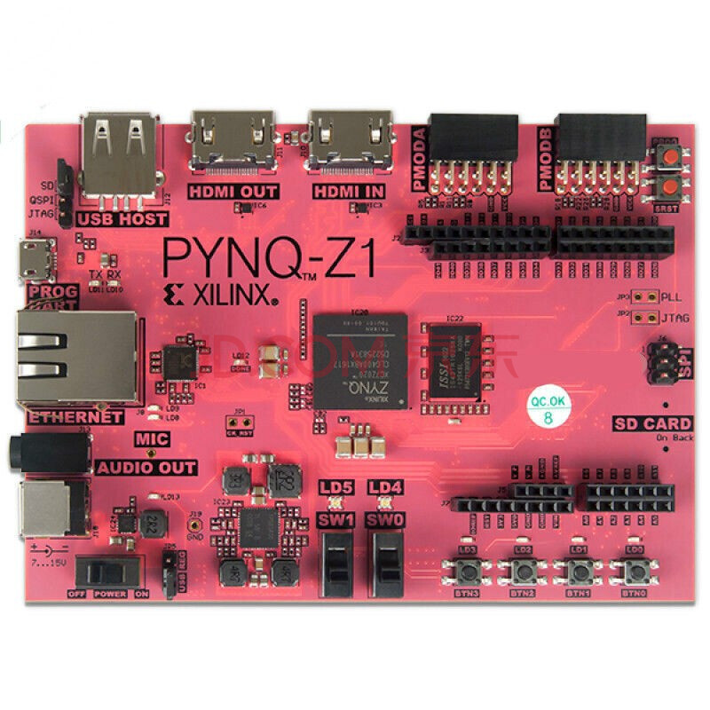

# 基于PYNQ的Vitis HLS IP快速设计与验证

## 实验背景
PYNQ 是一个开源框架，目标是使嵌入式编程人员能够在无需设计可编程逻辑电路的情况下即可充分发挥 Xilinx Zynq 全可编程 SoC 的功能。与常规方式不同的是通过 PYNQ ，设计人员可以通过 Python 语言和库，利用 Zynq 中融合可编程逻辑PL端和微处理器PS端的优势来快速构建更强大的嵌入式系统，其代码可直接在支持 PYNQ 的开发板上进行开发和测试

 

在传统的 Xilinx FPGA 开发流程中，我们需要使用 RTL 级语言来进行硬件描述，例如 Verilog / VHDL，在或是 Chisel ,在复杂算法的实现中，这将花费大量精力来进行开发和验证，这是由于描述语言的抽象级别所决定的，而在 Vitis HLS 中我们可以使用高级语言进行快速的 IP 设计。

## 实验内容  
本次实验将使用 Vitis HLS 进行 IP 的快速设计与验证，基于 PYNQ 平台实现，充分发挥 PS 和 PL 端的功能，在实验一中我们将首先使用 Xilinx HLS 进行加速器 IP 的开发，将加速器固化在 PL 端，并在PS端开发 Python 程序进行加速器 IP 的快速测试，在实验二中我们会在 PS 端的 Linux 上开发 C++ 程序,同样实现 PS 端与 PL 端的交互，最后在实验三中，将在 PL 端实现 RISC-V 软核，并开发控制程序驱动加速器，将程序执行情况通过系统调用返回到 PS 端，在 PS 进行观察，充分利用 PYNQ 中 PL 端与 PS 端的功能   

## 实验准备
### Hardware
- PYNQ-Z1
- RJ45网线
- Micro-USB线

### Software
- Xilinx Vitis HLS 2020.2
- Xilinx Vivado 2020.2
- Xilinx Vivado 2016.2
### Environment
- Ubuntu 20.04.6 LTS

## 实验目录

- 1. [使用 Python 进行 HLS IP 的快速验证](Chapter1_pynq_z1_acc.md)  
 
- 2. [使用 C++ 进行 HLS IP 的快速验证](Chapter2_verification_using_c.md)  

- 3. [在 Rocket Chip 上添加 HLS IP ](Chapter3_hls_with_rocketchip.md)   

